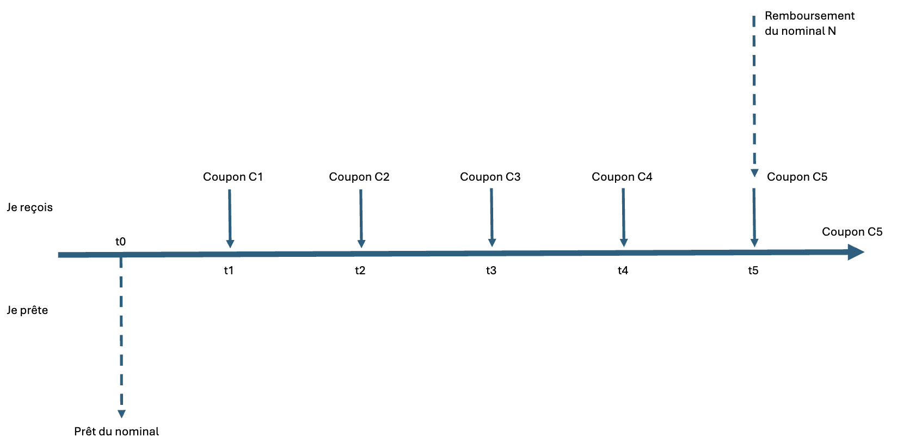
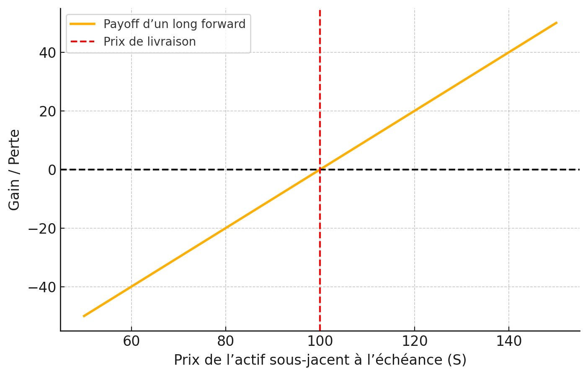
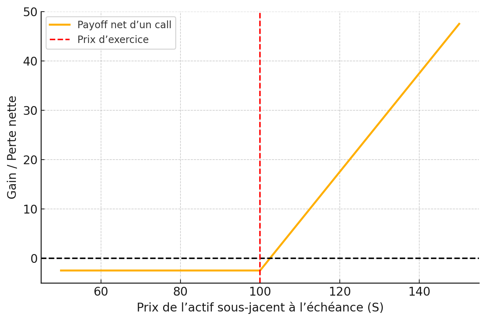
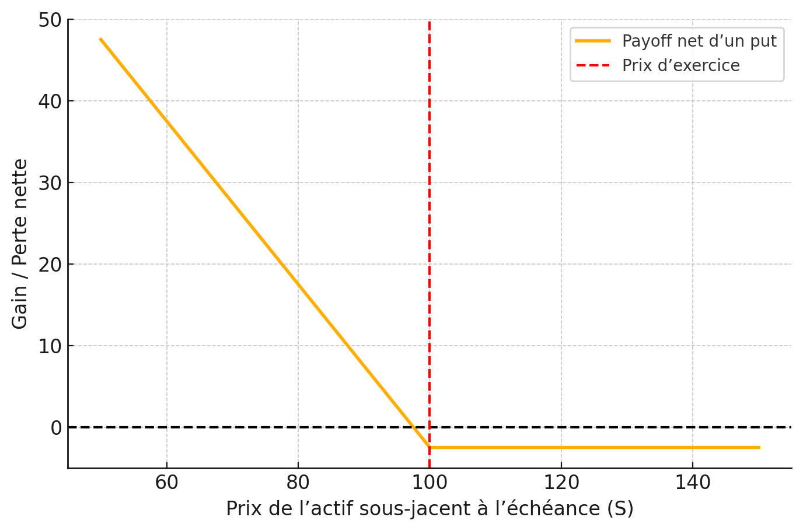

Dans le secteur financier, le marché désigne l’endroit où se rencontrent l’offre et la demande de services ou de produits financiers. Il regroupe de nombreux acteurs, notamment les banques, les institutions financières, les entreprises et les particuliers.
Parmi les différents produits financiers échangés, on trouve les actions, les obligations, les produits dérivés, les devises et les matières premières...

Dans cet article, nous allons examiner trois types de marchés financiers, à savoir le marché des actions, des obligations et des produits dérivés, leurs caractéristiques ainsi que leur mode de fonctionnement.

## Marchés des actions

Le marché des actions permet aux entreprises de lever des fonds en émettant des titres de propriété (actions) que les investisseurs peuvent acheter. Ces actions sont ensuite échangées sur des bourses telles que Euronext Paris ou le New York Stock Exchange.
Les prix des actions varient en fonction de l'offre et de la demande, influencées par les performances de l'entreprise, les conditions économiques et les sentiments du marché.

Les acteurs principaux de ce marché sont les entreprises émettrices, les investisseurs institutionnels (fonds de pension, compagnies d'assurance) et les investisseurs individuels. Pour acheter ou vendre des actions, les investisseurs passent généralement par des courtiers en ligne ou des banques d'investissement. Ils emmettent des ordres d'achat (bid) ou de vente(ask), qu'on peut visualiser dans un carnet d'ordres, qui sont ensuite exécutés sur le marché. Il existe plusieurs types d'ordres :

- **Ordre au marché** : achat ou vente immédiate au meilleur prix disponible.
- **Ordre à cours limité** : permet d’acheter ou de vendre une quantité de titres avec une condition de prix, donc avec une maîtrise du cours auquel l’ordre sera exécuté.Il permet ainsi de fixer le cours d'objectif d'achat ou de vente.
- **Ordre à seuil de déclenchement** : il s'agit d'un ordre qui ne sera exécuté que si le prix atteint un certain seuil. Il est souvent utilisé pour limiter les pertes ou sécuriser les gains. Pour un achat, il est placé en dessous du prix actuel du marché, et pour une vente, au dessus.
- **Ordre à plage de déclenchement** : il s'agit d'un ordre qui ne sera exécuté que si le prix atteint un certain seuil, mais qui est limité dans le temps. Il est souvent utilisé pour limiter les pertes ou sécuriser les gains. Pour un achat, il est placé en dessous du prix actuel du marché, et pour une vente, au dessus.
- **Ordre suiveur** : ce type d'ordre repose sur le même principe qu’un ordre à seuil de déclenchement à la différence que l’on saisira un pourcentage de variation et non un seuil en euros.

Il existe également d'autres types dordres tactiques (ordre séquence, etc.) qui permettent de gérer des stratégies d'investissement plus complexes.

> 💡 En France, l'Autorité des marchés financiers (AMF) supervise le marché pour assurer sa transparence et son bon fonctionnement.

### Fixation du cours d'une action

Le prix d'une action est déterminé par le jeu de l’offre et de la demande sur le marché. Lorsque la demande pour une action augmente, son prix tend à augmenter. Inversement, si l’offre dépasse la demande, le prix diminue. Le cours d'une action ne reflète pas directement le bid ni le ask, mais l’intersection effective entre eux, c’est-à-dire là où une offre et une demande se sont croisées.

Ce prix est également influencé par des facteurs fondamentaux tels que : les bénéfices de l’entreprise, les dividendes distribués, les perspectives de croissance, ainsi que les conditions économiques générales.

À la clôture de la bourse, le cours de clôture correspond au dernier prix auquel l’action a été échangée. Ce prix peut être différent du prix d’ouverture du lendemain en raison d’événements ou de mouvements de marché survenus en dehors des heures d’ouverture (after-hours trading).

## Marché obligataire

Le marché obligataire est un marché où les investisseurs achètent et vendent des obligations.
Les obligations sont des titres de créance émis par des gouvernements ou des entreprises pour lever des fonds. Une obligation est un contrat entre un émetteur et un investisseur, dans lequel l’émetteur s’engage à rembourser l’investisseur à une date future, tout en lui versant des intérêts (appelés coupons) à intervalles réguliers.

Dans ce contrat, l’émetteur contracte une dette sur le marché obligataire.
L’investisseur prête de l’argent en achetant l’obligation, et en échange, il perçoit des intérêts jusqu’à l’échéance, date à laquelle il récupère le capital prêté (la valeur nominale).

Les obligations sont généralement considérées comme des investissements à faible risque, car elles offrent souvent un rendement fixe et sont moins volatiles que les actions. Cependant, leur rendement est généralement inférieur à celui des actions, ce qui en fait un choix moins attrayant pour les investisseurs à la recherche de rendements élevés.

Les obligations peuvent être classées selon leur émetteur, leur durée, et leur taux d’intérêt :
- Les obligations d'État sont émises par les gouvernements.
- Les obligations d’entreprise sont émises par des sociétés privées ou publiques.
- Les obligations à court terme ont une durée inférieure à cinq ans, tandis que les obligations à long terme ont une durée supérieure à dix ans.
- Le taux d’intérêt des obligations est généralement fixe, mais certaines peuvent avoir un taux variable.
- Les obligations sont également classées selon leur notation de crédit, qui évalue la capacité de l’émetteur à rembourser la dette.

### Caractéristiques d'une obligation

Une obligation comprend plusieurs éléments clés :
- Identité de l'émetteur : L’entité qui émet l’obligation (États, entreprises, banques, collectivités...)
- Devise d'émission : La monnaie dans laquelle l’obligation est émise (euro, dollar, yen...)
- Valeur nominale : Montant, notée N, que l’émetteur s’engage à rembourser à l’échéance.
- Date de maturité : Date, notée T, à laquelle la valeur nominale doit être remboursée à l’investisseur.
- Coupon (C) : Intérêts, notés C, versés périodiquement à l’investisseur jusqu’à la date de maturité. Cela est généralement exprimé en pourcentage de la valeur nominale afin de favoriser la comparaison entre les obligations.

Schématisation d'une obligation (taux fixe, maturité 5 ans)

### Valorisation d'une obligation

La valorisation d’une obligation consiste à déterminer sa valeur actuelle, c’est-à-dire le montant qu’un investisseur est prêt à payer pour l’acheter aujourd’hui. La valeur d'une obligation dépend de plusieurs facteurs, 

$$
B(t,T) = \sum_{t=1}^{T} \frac{C}{(1+r)^t} + \frac{N}{(1+r)^T}
$$

Comme on peut le constater, cette valeur dépend de plusieurs facteurs, notamment :
- Le taux d’intérêt du marché ($r$) : Si le taux d’intérêt du marché augmente, la valeur des obligations existantes diminue, car les investisseurs préfèrent acheter de nouvelles obligations offrant des rendements plus élevés.
- La durée restante jusqu’à l’échéance ($T-t$) : Plus la durée restante est longue, plus la valeur de l’obligation est sensible aux variations des taux d’intérêt.
- Le taux de coupon ($c$): Un taux de coupon plus élevé rend l’obligation plus attrayante, ce qui augmente sa valeur.

La valeur d'une obligation dépend également de la qualité de crédit de l’émetteur. Si la qualité de crédit de l’émetteur diminue, la valeur de l’obligation diminue également, car les investisseurs perçoivent un risque accru de défaut.

> 💡 Lorsqu'une obligation est sans coupon, on l'appelle une obligation zéro coupon. Dans ce cas, la valorisation de l'obligation est plus simple, car il n'y a pas de paiements d'intérêts périodiques. La valeur actuelle d'une obligation zéro coupon est simplement la valeur nominale actualisée à la date d'échéance : $B(t,T) = \frac{N}{(1+r)^{T-t}}$.

## Marché des produits dérivés

Les produits dérivés sont des instruments financiers dont la valeur dépend d'un actif sous-jacent. Parmi les produit dérivés, on trouve les options, les futures, les forwards, et les swaps. Ces instruments sont utilisés pour diverses raisons, notamment le hedging, la spéculation sur les mouvements de prix futurs, et l'arbitrage entre différents marchés.

Un trader est en position de hedging lorsqu'il a une exposition au prix d'un actif et prend une position dans un dérivé pour compenser l'exposition. Dans une spéculation, le trader n'a pas d'exposition à compenser. Il parie sur les mouvements futurs du prix de l'actif pour se faire un profit. L'arbitrage implique de prendre une position sur deux ou plusieurs marchés différents pour avoir un profit sans risque, i.e. avec une certitude de gain. 

*Exemple d'opportunité d'arbitrage : Soit un actif sous-jacent qui se négocie à 100 $ sur le marché A et à 105 $ sur le marché B. Un trader peut acheter l'actif sur le marché A et le vendre sur le marché B, réalisant ainsi un profit de 5 $ par unité sans risque.*

Les produits dérivés sont échangés sur des marchés organisés (marchés à terme) ou de gré à gré (Over-The-Counter, OTC).
Les marchés organisés sont réglementés, centralisés et proposent des contrats standardisés (quantité, échéance, actif sous-jacent, etc.). Des bourses de contrats à terme telles que le CME (Chicago Mercantile Exchange) en sont des exemples.
Ces marchés garantissent l’exécution des contrats grâce à une chambre de compensation, à travers l’utilisation de marges, c’est-à-dire le dépôt d’une fraction de la valeur totale du contrat pour ouvrir une position. Ces marges seront ajustées au fur et à mesure, à une fréquence quotidienne (daily settlement, marking to market) que le prix de l’actif sous-jacent fluctue pour tenir compte des gains ou des pertes réalisés sur la position. Cela permet aisi de réduire le risque de contrepartie.

À l’inverse, les marchés OTC sont décentralisés, moins réglementés et permettent de conclure des contrats sur mesure directement entre deux contreparties.

Sur ces marchés, les transactions sont déterminées par deux prix clés : le bid et le ask.
Le bid est le prix auquel un acheteur est prêt à acheter l’actif, tandis que le ask est le prix auquel un vendeur est prêt à vendre. La différence entre ces deux prix est appelée le bid-ask spread, qui est un indicateur de la liquidité du marché :
- Un spread étroit reflète un marché liquide et compétitif (souvent sur marchés organisés).
- Un spread large reflète une liquidité plus faible ou une incertitude élevée (fréquent sur les marchés OTC).

### Forward

Un contrat forward est un accord entre deux parties pour acheter ou vendre un actif à un prix convenu $K$ à une date future $T$. Contrairement aux contrats à terme (futures), les contrats forward sont négociés de gré à gré et ne sont pas standardisés. Généralement, les contrats forward sont hedgés par des institutions financières, car elles permettent de *neutraliser le risque*.

Le payoff d'un contrat forward est donné par la formule suivante :
$$
\text{Payoff}_{\text{long position}} = S_T - K, \quad
\text{Payoff}_{\text{short position}} = K - S_T,
$$

où $S_T$ est le prix de l'actif sous-jacent à la date d'échéance, et $K$ est le prix convenu dans le contrat.

> 💡 La vente d’un contrat à terme correspond à une position courte (short position), tandis que son achat correspond à une position longue (long position).

Exemple :
Soit une companie X qui doit payer £10 millions le 31 mars, sachant qu'on est le 31 décembre. Pour se protéger contre la hausse du prix de la livre sterling, la compagnie X peut acheter un contrat forward, i.e. il a l'obligation d'acheter le livre sterling à un prix convenu. Supposons que le prix convenu soit de £1,20. Si le prix de la livre sterling augmente à £1,30 à l'échéance, la compagnie X économise £1 million en utilisant le contrat forward. De ce fait, le risque est neutralisé.

  
Schématisation d'un contrat forward

  

### Options

Les options sont des produits dérivés qui **donnent à l'acheteur le droit, mais pas l'obligation**, d'acheter ou de vendre un actif sous-jacent à un prix convenu (prix d'exercice) à une date future, échangés sur des marchés organisés ou de gré à gré. Il existe deux types d'options : les options d'achat (call options) et les options de vente (put options).

> 💡 On dit qu'on est en position longue (long position) lorsqu'on achète une option, et en position courte (short position) lorsqu'on la vend. Le vendeur d'une option est appelé le "preneur de risque", car il doit honorer l'option si l'acheteur décide de l'exercer.
>> *Ex : Si l’on est en position courte sur une option de vente (put option), on a l’obligation d’acheter l’actif sous-jacent à un prix convenu si l’option est exercée. Si l'on est en position longue, on a le droit d'exiger la vente de l'actif sous-jacent à un prix convenu si l'option est exercée.*

L'on peut utiliser les options pour hedger ou pour spéculer sur la hausse ou la baisse de son prix. Les options sont également utilisées pour générer des revenus supplémentaires grâce à la vente d'options.

Le payoff d'une option est donné par la formule suivante :
$$
\text{Payoff}_{\text{call}} = \max(S_T - K, 0), \quad
\text{Payoff}_{\text{put}} = \max(K - S_T, 0),
$$
où $S_T$ est le prix de l'actif sous-jacent à la date d'échéance, et $K$ est le prix d'exercice de l'option.
Le prix d'exercice est le prix auquel l'acheteur de l'option peut acheter ou vendre l'actif sous-jacent. Le prix d'exercice est fixé au moment de l'achat de l'option et reste constant jusqu'à l'échéance de l'option.

Schématisation d'une option d'achat (call option) coûtant 2.5€

Schématisation d'une option de vente (put option) coûtant 2.5€

### Futures

Les contrats à terme (futures) sont des contrats standardisés négociés sur des marchés organisés, qui obligent l'acheteur à acheter et le vendeur à vendre un actif sous-jacent à un prix convenu à une date future. Contrairement aux contrats forward, les contrats futures sont standardisés en termes de taille de contrat, de lieux de livraison, de date d'échéance et de qualité de l'actif sous-jacent.
Il existe également des limites de prix pour éviter des fluctuations excessives. Le payoff d'un contrat future est similaire à celui d'un contrat forward.

Par ailleurs, les contrats futures sont réglés quotidiennement (daily settlement) par le biais d'une chambre de compensation, qui garantit l'exécution des contrats et réduit le risque de contrepartie. Cela signifie que les gains et les pertes sont calculés quotidiennement, et les marges sont ajustées en conséquence. Les traders doivent maintenir un niveau de marge minimum pour éviter d'être appelés à déposer des fonds supplémentaires (margin call) si la valeur de leur position diminue.

De plus, pour éviter toute opportunité d’arbitrage, les prix des contrats futures convergent vers le prix au comptant de l’actif sous-jacent à l’échéance du contrat. Cela signifie qu’à la date d’échéance, le prix d’un contrat future doit être très proche du prix spot de l’actif sous-jacent. Dans le cas contraire, les traders pourraient réaliser un profit sans risque en achetant ou vendant l’actif sur le marché au comptant tout en prenant une position opposée sur le marché des futures.

### Swaps

#### TO DO

