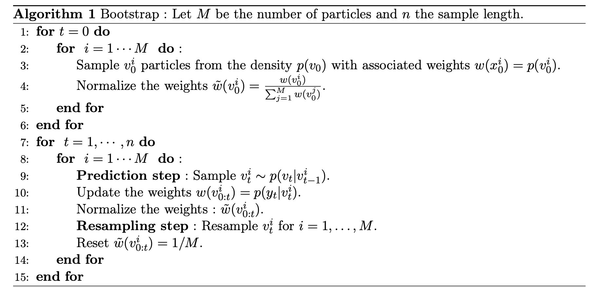
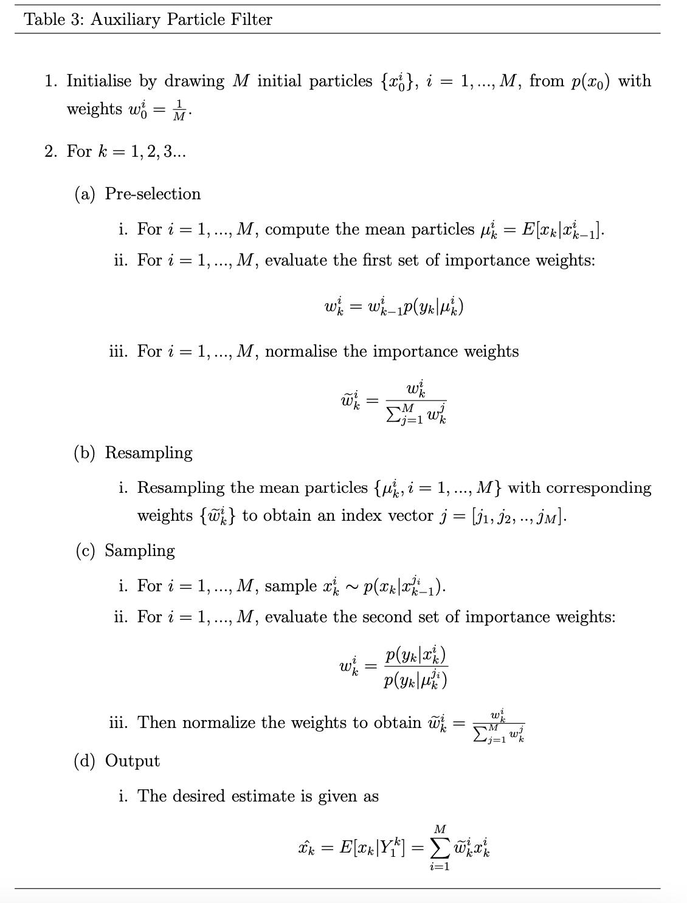

::: {.qf-meta}
Catégorie
:   Dérivés & pricing · Volatilité stochastique

Statut
:   Terminé

Langages
:   Python, R

Travail
:   Notebook de calibration (Python) et étude de simulation (R), avec S. Marthely pour l'étude APF
:::

## Vue d'ensemble

Dans le modèle de Heston, la variance instantanée $v_t$ est un processus
stochastique **non observable** : seuls les prix du sous-jacent et des options
sont visibles. Calibrer le modèle revient donc à résoudre simultanément deux
problèmes — estimer un état caché et estimer les paramètres qui gouvernent sa
dynamique.

Ce projet traite le problème par **filtrage particulaire**. Il implémente le
filtre bootstrap et l'*auxiliary particle filter* (APF) sur le modèle de Heston
discrétisé, puis conduit une étude de simulation comparant les deux filtres
selon la moneyness des options utilisées comme observations : à la monnaie
(ATM), dans la monnaie (ITM) et en portefeuille mixte.

## Contexte financier

Le modèle de Black-Scholes suppose une volatilité constante, ce que le *smile*
de volatilité implicite contredit directement. Le modèle de Heston introduit
une variance stochastique à retour à la moyenne, corrélée au rendement du
sous-jacent, ce qui lui permet de reproduire à la fois le smile et son
asymétrie.

Son adoption en salle de marché pose toutefois une question pratique : comment
estimer un état non observé à partir de prix bruités, et avec quelle précision
selon les instruments retenus pour la calibration ? La réponse conditionne
directement la qualité du *hedging* en vega et la valorisation des produits
exotiques sensibles à la dynamique de volatilité.

## Méthodologie

**1. Pricing de référence.** Prix du call européen sous Heston par la forme
semi-analytique (fonction caractéristique), puis contrôle par Monte-Carlo avec
schéma d'Euler sur le système couplé prix / variance.

**2. Modèle espace-état.** Le modèle de Heston discrétisé est réécrit sous
forme d'un modèle à espace d'états : la variance instantanée constitue l'état
caché, le prix d'option observé constitue l'observation bruitée.

**3. Filtrage.** Deux filtres particulaires sont implémentés :

- le **filtre bootstrap**, qui propage les particules selon la densité de
  transition puis les repondère par la vraisemblance d'observation ;
- l'**auxiliary particle filter**, qui introduit une étape de présélection des
  particules en fonction de leur compatibilité anticipée avec l'observation
  suivante, afin de limiter la dégénérescence des poids.

Une variante modifiée de l'APF est également testée.

**4. Étude de simulation.** Les deux filtres sont comparés sur des jeux de
données simulés, pour trois configurations d'options : $K = S$ (ATM),
$K = 0{,}95\,S$ et un portefeuille mixte mêlant options dans et hors de la
monnaie. La comparaison est menée en erreur quadratique moyenne sur la
trajectoire de variance reconstituée.

## Cadre mathématique

**Dynamique de Heston.** Sous la probabilité risque-neutre,
$$
\begin{cases}
\mathrm{d}S_s = S_s\left( r\,\mathrm{d}s + \sqrt{v_s}\,\mathrm{d}W_s^1 \right) \\[2pt]
\mathrm{d}v_s = \kappa(\beta - v_s)\,\mathrm{d}s + \sigma \sqrt{v_s}\,\mathrm{d}W_s^2 \\[2pt]
\mathrm{d}W_s^1\,\mathrm{d}W_s^2 = \rho\,\mathrm{d}s
\end{cases}
$$
où $\kappa > 0$ est la vitesse de retour à la moyenne, $\beta > 0$ le niveau de
variance de long terme, $\sigma$ la volatilité de la variance et
$\rho \in [-1,1]$ la corrélation entre les deux browniens. La variance suit le
processus de Cox-Ingersoll-Ross introduit en 1985 pour les taux courts ; la
condition de Feller $2\kappa\beta > \sigma^2$ garantit sa stricte positivité.

**Densité de transition exacte.** Le processus CIR admet une densité de
transition non centrée du chi-deux :
$$
p(v_t \mid v_{t-1}) = 2c\,\chi^2\!\left(2c\,v_t;\; 2q + 2;\; 2c\,e^{-\kappa \Delta} v_{t-1}\right),
$$
avec
$$
c = \frac{2\kappa}{\sigma^2\left(1 - e^{-\kappa \Delta}\right)},
\qquad
q = \frac{2\kappa\beta}{\sigma^2} - 1 .
$$
Simuler directement selon cette loi évite le biais de discrétisation du schéma
d'Euler, en particulier lorsque la variance s'approche de zéro.

**Filtrage particulaire.** Le filtre bootstrap approche la loi filtrée
$p(v_t \mid y_{1:t})$ par un système de particules pondérées
$\{v_t^{(i)}, w_t^{(i)}\}_{i=1}^M$ :
$$
v_t^{(i)} \sim p\bigl(v_t \mid v_{t-1}^{(i)}\bigr),
\qquad
w_t^{(i)} \propto w_{t-1}^{(i)}\, p\bigl(y_t \mid v_t^{(i)}\bigr).
$$
L'APF modifie l'échantillonnage en introduisant une variable auxiliaire $k$
qui présélectionne les particules selon
$$
p\bigl(k,\, v_t \mid y_{1:t}\bigr)
\;\propto\;
p\bigl(y_t \mid \mu_t^{(k)}\bigr)\, w_{t-1}^{(k)}\, p\bigl(v_t \mid v_{t-1}^{(k)}\bigr),
$$
où $\mu_t^{(k)}$ est une valeur représentative (moyenne ou mode) de la loi de
transition issue de la particule $k$. Cette anticipation réduit la variance des
poids lorsque la vraisemblance d'observation est très informative.

**Dégénérescence.** Le rééchantillonnage est déclenché sur la taille effective
d'échantillon
$$
\mathrm{ESS}_t = \Bigl(\textstyle\sum_{i=1}^M (w_t^{(i)})^2\Bigr)^{-1}.
$$

## Données

Séries simulées sous le modèle de Heston avec des paramètres fixés, ce qui
permet de disposer de la **trajectoire de variance vraie** et donc de mesurer
objectivement l'erreur de filtrage — ce qui serait impossible sur données
réelles. Le volet calibration sur prix d'options observés s'appuie sur les
données de marché conservées dans
`3A/proc_stochastique/data/`.

## Implémentation

Le module
[`heston.py`](https://github.com/usenameFD/usenameFD.github.io/blob/main/projects/Calibration/heston.py)
regroupe :

- `heston(...)` — prix de call européen sous Heston ;
- `SimHeston(...)` — simulation conjointe prix / variance ;
- `Bootstrap_Heston(...)` — filtre bootstrap ;
- `APF(...)` et `APF_modified(...)` — *auxiliary particle filter* et sa
  variante ;
- `resample_particles(...)` — étape de rééchantillonnage.

L'étude de simulation comparative est menée en R, avec la fonction de pricing
`Heston_Call_Function.R` et les résultats sérialisés dans
`3A/proc_stochastique/results_sim/` (configurations ATM, ITM et mixte).

## Résultats

Les trajectoires filtrées, les superpositions avec l'état vrai et les erreurs
quadratiques moyennes par configuration sont présentées dans les documents
suivants :

[Consulter le notebook de calibration](Calibration/HestonModel.ipynb)

[Étude de simulation — performance du filtre APF](../3A/proc_stochastique/APF_filter.qmd)

[Pricing et calibration du modèle de Heston](../3A/proc_stochastique/modele_heston.qmd)

{fig-alt="Trajectoire de variance estimée par le filtre bootstrap superposée à la trajectoire simulée de référence"}

{fig-alt="Trajectoire de variance estimée par l'auxiliary particle filter superposée à la trajectoire simulée de référence"}

## Interprétation

L'intérêt de l'APF est conditionnel, et l'étude de simulation sert précisément
à identifier ce conditionnement. Lorsque la vraisemblance d'observation est
très piquée — options à la monnaie, dont le prix réagit fortement à la
variance — le filtre bootstrap gaspille des particules dans des régions
incompatibles avec l'observation, et la présélection de l'APF apporte un gain
net. Lorsque l'observation est peu informative sur la variance, l'avantage se
réduit et le surcoût algorithmique de l'APF n'est plus justifié.

Le choix des instruments de calibration n'est donc pas neutre : il détermine
l'information disponible sur l'état caché autant que l'algorithme employé pour
l'extraire.

## Limites et risque de modèle

- **Paramètres supposés connus.** L'étude de filtrage suppose les paramètres
  $(\kappa, \beta, \sigma, \rho)$ fixés ; l'estimation jointe état-paramètres
  est un problème sensiblement plus difficile.
- **Discrétisation.** Le schéma d'Euler sur le processus CIR peut produire des
  variances négatives ; l'usage de la loi de transition exacte est préférable
  mais plus coûteux.
- **Dégénérescence des poids.** Elle croît avec l'horizon et avec la dimension
  de l'état ; le rééchantillonnage la retarde sans la supprimer.
- **Données simulées.** Les performances mesurées sur données simulées sont
  optimistes par rapport à un cadre réel où le modèle est mal spécifié.
- **Condition de Feller.** Sa violation dégrade fortement le comportement
  numérique des filtres au voisinage de zéro.

## Technologies

::: {.qf-tags}
[Python]{.qf-tag} [R]{.qf-tag} [NumPy]{.qf-tag} [SciPy]{.qf-tag}
[Matplotlib]{.qf-tag}
:::

## Ressources

- [Consulter le notebook de calibration](Calibration/HestonModel.ipynb)
- [Voir le code source du module `heston.py`](https://github.com/usenameFD/usenameFD.github.io/blob/main/projects/Calibration/heston.py)
- [Étude de simulation — filtre APF](../3A/proc_stochastique/APF_filter.qmd)
- [Pricing et calibration du modèle de Heston](../3A/proc_stochastique/modele_heston.qmd)
- Projet connexe : [Volatilité stochastique de Taylor — Kalman et filtrage particulaire](volatilite-stochastique-taylor.qmd)
- Projet connexe : [Pricing d'options exotiques sous Heston, Bates et CIR](options-exotiques-bates-heston.qmd)

---

[← Retour aux projets](index.qmd)
