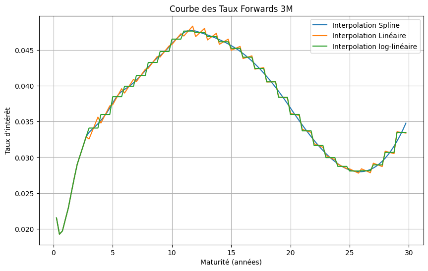

::: {.qf-meta}
Catégorie
:   Taux & fixed income

Statut
:   Terminé

Langages
:   Python

Travail
:   Projet collectif — F. D. Deba Wandji, M. Kougoum Moko Mani, F. Mbaiornom Mbaihodji
:::

## Vue d'ensemble

Aucun instrument de taux ne se valorise sans une courbe d'actualisation, et
cette courbe n'est jamais observée directement : elle se reconstruit à partir
des prix d'un ensemble d'instruments cotés.

Ce projet part de cette reconstruction — bootstrapping et interpolation d'une
courbe zéro-coupon, puis dérivation des taux forward — et va jusqu'à la
valorisation d'un produit structuré sous un modèle de taux court calibré. Entre
les deux, il valorise des caplets et des swaptions et met en évidence
l'influence, souvent sous-estimée, du choix d'interpolation sur les prix
obtenus.

## Contexte financier

La courbe des taux est l'objet central de toute la finance de taux : elle
détermine l'actualisation des flux, la valorisation des swaps, la mesure de la
duration d'un portefeuille obligataire et le prix des options de taux.

Deux questions pratiques sont traitées :

- **Le choix d'interpolation est-il neutre ?** Le taux forward est une dérivée
  de la courbe zéro-coupon ; une interpolation qui semble raisonnable sur les
  taux zéro peut produire des taux forward irréguliers, voire des discontinuités
  économiquement injustifiables. La comparaison entre interpolations spline,
  linéaire et log-linéaire visualise directement cet effet.
- **Comment passer d'une courbe statique à un modèle dynamique ?** Valoriser un
  produit structuré exige de simuler l'évolution future de la courbe, ce que
  permet le modèle de Hull-White, dérivé du cadre HJM et calibré pour
  reproduire exactement la courbe initiale.

## Méthodologie

**1. Reconstruction de la courbe zéro-coupon.** Formules de valorisation des
instruments de marché, puis extraction récursive des facteurs d'actualisation
par bootstrapping. Trois schémas d'interpolation sont mis en concurrence :
spline cubique, linéaire et log-linéaire.

**2. Courbe des taux forward.** Dérivation des taux forward 3 mois à partir de
la courbe zéro-coupon reconstruite, pour chacune des trois interpolations.

**3. Valorisation de caplets et de swaptions.** Prix calculés à partir de la
courbe zéro-coupon, avec comparaison explicite des résultats obtenus sous
interpolation linéaire et sous interpolation spline.

**4. Modèle de Hull-White.** Passage du cadre HJM au modèle de Hull-White,
énoncé des hypothèses, construction de la formule zéro-coupon, dynamique des
taux forward, valorisation des instruments de calibration, puis calibration
proprement dite.

**5. Produit structuré.** Valorisation par simulation Monte-Carlo sous le
modèle calibré.

## Cadre mathématique

**Facteurs d'actualisation et taux zéro-coupon.**
$$
B(0,T) = e^{-R(0,T)\,T},
\qquad
R(0,T) = -\frac{\ln B(0,T)}{T}.
$$

**Taux forward.** Le taux forward simplement composé entre $T_1$ et $T_2$ et le
taux forward instantané s'écrivent
$$
F(0;T_1,T_2) = \frac{1}{T_2 - T_1}\left( \frac{B(0,T_1)}{B(0,T_2)} - 1 \right),
\qquad
f(0,T) = -\frac{\partial \ln B(0,T)}{\partial T}.
$$
Le taux forward instantané étant une **dérivée** de la courbe, la régularité de
l'interpolation choisie se répercute directement sur sa régularité — d'où
l'aspect en escalier des interpolations linéaire et log-linéaire.

**Cadre HJM.** La dynamique du taux forward instantané s'écrit
$$
\mathrm{d}f(t,T) = \alpha(t,T)\,\mathrm{d}t + \sigma(t,T)\,\mathrm{d}W_t ,
$$
et l'absence d'opportunité d'arbitrage impose la condition de dérive
$$
\alpha(t,T) = \sigma(t,T)\int_t^{T}\sigma(t,u)\,\mathrm{d}u .
$$

**Modèle de Hull-White.** Le cas $\sigma(t,T) = \sigma e^{-a(T-t)}$ conduit à un
modèle de taux court markovien :
$$
\mathrm{d}r_t = \bigl(\theta(t) - a\,r_t\bigr)\mathrm{d}t + \sigma\,\mathrm{d}W_t ,
$$
où $\theta(t)$ est choisi pour reproduire exactement la courbe initiale :
$$
\theta(t) = \frac{\partial f(0,t)}{\partial t} + a\,f(0,t)
+ \frac{\sigma^2}{2a}\left(1 - e^{-2at}\right).
$$
Le prix zéro-coupon admet une forme affine
$$
B(t,T) = A(t,T)\,e^{-B(t,T)\,r_t},
\qquad
B(t,T) = \frac{1 - e^{-a(T-t)}}{a}.
$$

**Caplet.** Un caplet de strike $K$ sur la période $[T_1,T_2]$ est équivalent à
un put sur zéro-coupon, ce qui fournit une formule fermée de type Black sous
Hull-White :
$$
\mathrm{Caplet} = (1 + K\,\delta)\,
\mathcal{P}\!\left( T_1, T_2, \frac{1}{1 + K\delta} \right),
$$
où $\mathcal{P}$ désigne le prix d'un put sur obligation zéro-coupon.

## Données

Données de marché de taux consolidées dans le fichier `Data.xlsx` fourni avec
le notebook : cotations des instruments servant au bootstrapping et paramètres
des instruments de calibration.

## Implémentation

Le projet est développé dans un notebook unique, structuré en trois blocs
successifs — reconstruction de courbe, valorisation de dérivés de taux, modèle
de Hull-White. Le dépôt GitHub associé contient exactement le notebook et son
jeu de données, ce qui rend l'analyse directement reproductible.

## Résultats

Courbes zéro-coupon et forward sous les trois interpolations, prix de caplets
et de swaptions comparés entre interpolations, paramètres de Hull-White
calibrés et valorisation du produit structuré.

[Consulter le notebook complet](Yield Curve/Projet_courbe_taux.ipynb)

{fig-alt="Trois courbes de taux forward 3 mois superposées, obtenues par interpolation spline, linéaire et log-linéaire, sur des maturités de 0 à 30 ans"}

## Interprétation

Le graphique des taux forward résume l'enseignement principal du projet : les
trois interpolations produisent des courbes zéro-coupon visuellement très
proches, mais des taux forward nettement différents. Les interpolations
linéaire et log-linéaire génèrent un profil en escalier, artefact purement
numérique sans contrepartie économique, alors que l'interpolation spline
fournit une courbe lisse.

Comme le prix d'un caplet dépend directement du taux forward de sa période de
référence, cet artefact se transmet mécaniquement aux prix. Le choix
d'interpolation est donc une hypothèse de modèle, et non un simple détail
d'implémentation — un point systématiquement examiné en validation de modèles
de courbe.

## Limites et risque de modèle

- **Modèle à un facteur.** Hull-White ne capture que des déplacements
  parallèles et amortis ; il ne reproduit ni les rotations de pente ni les
  déformations de courbure.
- **Volatilité constante.** Une volatilité $\sigma$ constante ne reproduit pas
  la structure par terme des volatilités implicites de swaptions.
- **Taux gaussiens.** Le modèle autorise des taux négatifs — propriété
  aujourd'hui réaliste mais qui reste une conséquence de la spécification, non
  un choix délibéré.
- **Bootstrapping.** La courbe reconstruite dépend de l'ensemble d'instruments
  retenus et de leurs conventions de calcul.
- **Courbe unique.** L'analyse ne distingue pas courbe d'actualisation OIS et
  courbe de projection, distinction devenue standard depuis 2008.

## Technologies

::: {.qf-tags}
[Python]{.qf-tag} [NumPy]{.qf-tag} [SciPy]{.qf-tag} [pandas]{.qf-tag}
[Matplotlib]{.qf-tag} [openpyxl]{.qf-tag}
:::

## Ressources

- [Consulter le notebook complet](Yield Curve/Projet_courbe_taux.ipynb)
- [Consulter le dépôt GitHub](https://github.com/usenameFD/Mod-les-de-courbes-de-taux)
- Projet connexe : [Bibliothèque de pricing et application Dash](bibliotheque-pricing-dash.qmd)
- Projet connexe : [Gestion des risques en asset management](risques-asset-management.qmd)

---

[← Retour aux projets](index.qmd)
