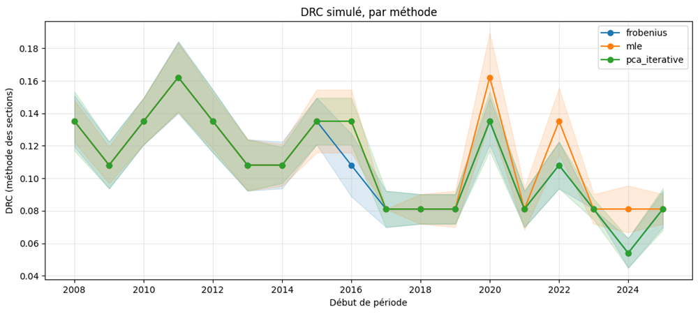

::: {.qf-meta}
Catégorie
:   Risque de crédit · Réglementation prudentielle

Statut
:   Terminé — mémoire de fin d'études

Langages
:   Python

Source primaire
:   *Modélisation du Default Risk Charge — Calibration comparée des sensibilités
    factorielles et application à un portefeuille d'actifs du CAC 40*,
    mémoire de stage, M2 Modélisation Aléatoire, Université Paris Cité, 2025-2026 (47 p.)
:::

## Vue d'ensemble

Le *Default Risk Charge* (DRC) est la composante de la revue fondamentale du
portefeuille de négociation (FRTB) qui capitalise le risque de défaut soudain
d'un émetteur — un risque que la VaR de marché, calibrée sur des variations de
prix à 10 jours, ne capture pas. Un modèle interne de DRC repose sur un modèle
latent gaussien multifactoriel dont la pièce maîtresse est la **structure de
dépendance des défauts**.

Une hypothèse implicite traverse une partie de la littérature : le choix de la
méthode de calibration serait secondaire dès lors que le cadre théorique
gaussien multifactoriel est correctement posé. Ce mémoire en propose une lecture
plus nuancée, en comparant trois méthodes de calibration — **ACP itérative**,
**minimisation de la norme de Frobenius** et **maximum de vraisemblance** — sur
un portefeuille équipondéré de 37 émetteurs du CAC 40, puis en mesurant si les
écarts de calibration survivent jusqu'au DRC réglementaire.

La calibration par maximum de vraisemblance constitue, à ma connaissance, un
apport nouveau à la modélisation du DRC.

## Contexte financier

Le DRC répond à une limite structurelle du dispositif de risque de marché :
entre deux dates d'observation, un émetteur peut faire défaut sans que sa
volatilité de prix n'ait signalé quoi que ce soit. Le texte impose donc une
mesure distincte — un quantile à **99,9 % sur horizon un an** — et au moins
**deux facteurs systématiques** dans le modèle de dépendance.

Trois enjeux opérationnels structurent le travail.

**L'ambiguïté réglementaire sur la « période de tension ».** Le texte prescrit
une calibration en période de stress sans définir de procédure d'identification
comparable à celle du risque de marché général. Cette ambiguïté, documentée par
Laurent, Sestier et Thomas (2016), transfère au modélisateur un degré de
liberté à fort impact prudentiel : il faut donc mesurer la sensibilité du DRC au
choix de la fenêtre.

**Le critère de calibration comme choix de modèle.** Ajuster un modèle contre
une matrice de corrélation cible calculée à part n'est pas équivalent à
l'ajuster contre sa propre vraisemblance. La distinction est théorique au
chapitre 2 ; la question est de savoir si elle est mesurable au chapitre 3.

**Ce qu'une politique de validation doit surveiller.** Si les écarts de
calibration se concentrent sur certains blocs d'émetteurs, un dispositif de
validation qui ne contrôlerait que le DRC ponctuel resterait aveugle à des
différences pourtant réelles.

## Méthodologie

### Modèle latent

Pour chaque émetteur $k$, une variable latente est décomposée en une composante
systématique et une composante idiosyncratique. Le défaut survient lorsque cette
variable franchit un seuil déterminé par la probabilité de défaut marginale, et
la perte de portefeuille agrège les expositions des émetteurs en défaut.

### Trois méthodes de calibration (chapitre 2)

| Méthode | Critère ajusté | Traitement de $\Sigma_Z$ |
|---|---|---|
| **ACP itérative** | correspondance à la cible $C_0$, par diagonalisations successives de la corrélation corrigée de sa diagonale | fixé à $I_J$ |
| **Frobenius** | $\lVert C_0 - C(\beta,\Sigma_Z)\rVert_F$ sous contrainte | fixé à $I_J$ |
| **Maximum de vraisemblance** | vraisemblance gaussienne du modèle (algorithme EM) | fixé à $I_J$ pour la comparaison ; estimable conjointement |

Frobenius et maximum de vraisemblance **partagent le même solveur** — un
gradient projeté spectral avec projection ligne à ligne sur l'ellipsoïde
$\lVert\beta_k\rVert_{\Sigma_Z} \le 1$ — et ne diffèrent que par la fonction
objectif. Tout écart observé est donc la signature d'un changement de critère,
non d'une différence d'implémentation.

### Protocole empirique (chapitre 3)

- **Portefeuille** : constituants du CAC 40, poids $w_k = 1/K$ avec $K = 37$.
  La réplication d'indice est **délibérément écartée** afin d'isoler l'effet de
  la méthode de calibration de celui, distinct, d'une construction de
  portefeuille par optimisation.
- **Trois sous-périodes contrastées** : crise 2008 (P1), période médiane
  2013-2014 (P2), crise sanitaire 2020-2021 (P3).
- **Nombre de facteurs** : $J \in \{2, 3\}$ pour la comparaison principale, le
  critère de Marchenko-Pastur étant rapporté séparément comme diagnostic.
- **Estimateur de la cible** : corrélation empirique brute *et* version
  shrinkée, afin de tester la robustesse à ce choix annexe.
- **Tests statistiques systématiques** : stationnarité (ADF, KPSS) et normalité
  (Shapiro-Wilk, Kolmogorov-Smirnov) des facteurs et des résidus, pour chaque
  méthode et chaque période — réponse à une limite méthodologique commune à la
  littérature recensée au chapitre 1.
- **Benchmark standardisé** : approche CRR3 par pondérations forfaitaires,
  invariante par construction au choix de période.

## Cadre mathématique

**Variable latente et défaut.** Pour l'émetteur $k$,
$$
X_k = \beta_k^{\top} Z + \sigma_k \varepsilon_k,
\qquad
Z \sim \mathcal{N}(0, \Sigma_Z),
\qquad
\varepsilon_k \sim \mathcal{N}(0,1) \ \text{i.i.d.},
$$
avec la contrainte de normalisation $\operatorname{Var}(X_k) = 1$, soit
$\sigma_k = \sqrt{1 - \beta_k^{\top}\Sigma_Z\beta_k}$. Le défaut est l'événement
$$
D_k = \mathbf{1}\{X_k < c_k\},
\qquad
c_k = \Phi^{-1}(\mathrm{PD}_k).
$$

**Perte et charge.** Avec $\mathrm{JTD}_k$ l'exposition en cas de défaut et
$\mathrm{LGD}_k$ la perte en cas de défaut,
$$
L = \sum_{k=1}^{K} \mathrm{JTD}_k \, \mathrm{LGD}_k \, D_k ,
\qquad
\mathrm{DRC} = \mathrm{VaR}^{\text{1 an}}_{99,9\%}(L)
= \inf\{ q \in \mathbb{R} : \mathbb{P}(L \le q) \ge 0{,}999 \}.
$$

**Corrélation implicite.** Le modèle induit
$$
C(\beta, \Sigma_Z) = \beta\,\Sigma_Z\,\beta^{\top} + \operatorname{diag}(\sigma^2),
$$
que les deux premières méthodes rapprochent d'une cible $C_0$ estimée en amont.

**Équivalence vraisemblance / Kullback-Leibler.** Maximiser la vraisemblance
gaussienne revient à minimiser
$$
\mathrm{KL}\bigl(\mathcal{N}(0,C_0)\,\|\,\mathcal{N}(0,\Sigma_X(\beta))\bigr)
= \tfrac{1}{2}\Bigl[
\operatorname{tr}\bigl(\Sigma_X(\beta)^{-1} C_0\bigr)
- \ln \det\bigl(\Sigma_X(\beta)^{-1} C_0\bigr) - K \Bigr].
$$
Le terme $\operatorname{tr}(\Sigma_X(\beta)^{-1}C_0)$ **pénalise plus sévèrement
une sous-estimation de la corrélation là où la cible en porte déjà beaucoup**,
alors que la norme de Frobenius traite symétriquement tous les écarts. C'est
cette différence de géométrie qui produit l'essentiel des résultats empiriques.

**Intervalle de confiance par *sectioning*.** Le superviseur demande un
intervalle de confiance à 95 % sur le DRC (BCE, 2025, §128-129). Le portefeuille
étant équipondéré, $L$ ne prend que $K+1 = 38$ valeurs distinctes, toutes
multiples de $1/37$ : le quantile est **constant par paliers** et l'estimation
directe d'un intervalle est délicate. L'approche de Dong et Nakayama (2020) est
retenue : le budget de $M$ scénarios est divisé en $b$ sections de taille
$m = M/b$, l'intervalle étant centré sur l'estimateur global $\widehat{\mathrm{DRC}}_M$
— et non sur la moyenne des sections, ce qui évite le biais de petit échantillon :
$$
S_b^2 = \frac{1}{b-1}\sum_{\ell=1}^{b}
\bigl(\widehat{\mathrm{DRC}}_\ell - \widehat{\mathrm{DRC}}_M\bigr)^2,
\qquad
\Bigl[\widehat{\mathrm{DRC}}_M \pm t_{b-1,\alpha}\, S_b/\sqrt{b}\Bigr].
$$

## Données et hypothèses — traçabilité

| Élément | Valeur retenue | Source |
|---|---|---|
| Univers | 37 émetteurs du CAC 40 + indice `^FCHI` | `M2MO/DRC/data/raw_prices.csv`, cours de clôture depuis 2005 |
| Pondération | $w_k = 1/K$, $\mathrm{JTD}_k = V_0/37$, $V_0 = 1$ | mémoire, §3.1.1 et §3.3.1 |
| LGD | $\mathrm{LGD}_k = 1$ (100 %) | CRR3, fourchette actions 60-100 % |
| PD | PD historiques par notation, **plancher CRR3 de 3 pb** | mémoire, tableau 3.1 |
| Notations | **fictives** — assignées pour les besoins de l'exercice | mémoire, §3.1 et §4.3 (limite 2) |
| Simulations | $M = 200\,000$, $m = 10\,000$, $b = 20$ sections, IC 95 % | mémoire, §3.3.1 |
| Fenêtres | P1 2008, P2 2013-2014, P3 2020-2021 | mémoire, §3.1.2 |
| $\Sigma_Z$ | figé à $I_J$ pour les trois méthodes | mémoire, §4.3 (limite 3) |
| Panel glissant | fenêtres annuelles 2008 → 2025, $J \in \{2,3,4,5\}$, avec et sans shrinkage | `M2MO/DRC/output/*.csv` |

::: {.callout-important}
## Notations de crédit fictives

Les notations assignées aux 37 émetteurs sont **fictives** (mémoire, §4.3). Les
niveaux de DRC rapportés ci-dessous sont donc des résultats **méthodologiques**,
destinés à comparer des méthodes de calibration entre elles. Ils ne constituent
en aucun cas une estimation de l'exigence en fonds propres d'un portefeuille
réel, ni une évaluation de la qualité de crédit des émetteurs du CAC 40.
:::

## Implémentation

| Module | Rôle |
|---|---|
| `baseFactorModel.py` | classe abstraite : standardisation, spectre, sélection du nombre de facteurs, et les quatre routines de calibration (`frobenius`, `pca_iterative`, `em`, `ml`) |
| `spgSolver.py` | gradient projeté spectral, projection sur ellipsoïdes ligne à ligne, objectifs et gradients Frobenius et vraisemblance |
| `pCAFactorModel.py`, `autoEncoderFactorModel.py` | extraction des facteurs par ACP et par auto-encodeur non linéaire (Keras) |
| `drcModel.py` | moteur Monte-Carlo par batchs, Cholesky de $\Sigma_Z$, quantile 99,9 % et marge d'erreur |
| `drcStandard.py` | approche standardisée CRR3 : mapping notation → CQS → pondération de risque |
| `multiPeriodComparator.py`, `moving_drc.py` | panel méthode × période et DRC sur fenêtres glissantes |
| `dataLoader.py`, `indexReplicator.py` | chargement/découpage des prix, réplication d'indice par minimisation de la *tracking error* |
| `governance.py`, `correlation_calibrator.py`, `portfolio_manager.py` | variante orientée production (voir la note de cohérence ci-dessous) |

Le notebook d'application reprend chapitre par chapitre la structure du mémoire.
Quatre correctifs de code y sont explicitement documentés (filtre de données par
sous-période, garanties de monotonie de l'EM, indexation des batchs Monte-Carlo,
mutation silencieuse dans le comparateur multi-périodes).

## Résultats

Les résultats ci-dessous sont **repris tels quels** du mémoire et des fichiers de
sortie ; aucun calcul n'est relancé par ce site.

### DRC estimé sur les trois fenêtres de référence

Estimateur $\widehat{\mathrm{DRC}}_M$ en % du notionnel, 200 000 simulations,
*sectioning* à $b = 20$ (mémoire, tableau 3.5) :

| Configuration | $J$ | ACP | Frobenius | MLE |
|---|---|---|---|---|
| **P1** — crise 2008 | 2 | 13,51 ± 0,91 | 13,51 ± 1,08 | 13,51 ± 0,96 |
| | 3 | 13,51 ± 1,08 | 13,51 ± 1,08 | 13,51 ± 1,36 |
| **P2** — période médiane | 2 | 10,81 ± 0,96 | 10,81 ± 0,82 | 10,81 ± 0,87 |
| | 3 | 10,81 ± 0,96 | 10,81 ± 1,46 | 10,81 ± 1,46 |
| **P3** — crise sanitaire | 2 | 16,21 ± 1,08 | 16,21 ± 1,36 | 16,21 ± 1,39 |
| | 3 | 16,21 ± 1,16 | 16,21 ± 1,23 | 16,21 ± 1,29 |
| **P3 shrinkée** | 2 | **13,21** ± 1,08 | **13,21** ± 1,36 | **16,21** ± 1,39 |
| | 3 | 16,21 ± 1,16 | 16,21 ± 1,23 | 16,21 ± 1,29 |

### Structure de corrélation reconstruite

- ACP itérative et Frobenius convergent vers une **erreur de Frobenius
  identique à la quatrième décimale** — résultat également observé par
  Laurent et al. (2016) sur leur propre panel.
- L'écart de Frobenius du maximum de vraisemblance est **inférieur à 3 % en
  relatif** dans toutes les configurations testées.
- Cet écart se concentre sur le **sous-groupe financier** (4 émetteurs sur 37),
  où le maximum de vraisemblance reconstruit systématiquement une corrélation
  plus élevée : **0,69 contre 0,65** en crise 2008, **0,74 contre 0,69** en
  période médiane, **0,88 contre 0,81** en période covid. Sur le reste du
  portefeuille, les trois méthodes sont quasi identiques.
- **Aucun cas de Heywood** n'a été rencontré à $J = 2$ et $J = 3$ ; le ratio
  paramètres/observations $K \times J / T$ reste modéré (0,28 à $J=2$, 0,43 à
  $J=3$, avec $K = 37$, $T \approx 261$).
- Le critère de **Marchenko-Pastur désigne deux facteurs** comme statistiquement
  significatifs sur les trois fenêtres — nombre qui coïncide avec le minimum
  réglementaire, sans que cette coïncidence ait été recherchée.

### Dynamique sur fenêtres glissantes

{fig-alt="Trois courbes de DRC simulé (Frobenius, MLE, ACP itérative) sur des fenêtres annuelles de 2008 à 2025, chacune entourée d'une bande de confiance"}

Le panel annuel 2008-2025 prolonge les trois fenêtres de référence. Les niveaux
restent des multiples de $1/37$ : 13,51 % (5 défauts) en 2008, 8,11 % (3 défauts)
en 2025, avec des pics au-dessus de 16 % en 2011 et 2020. Fichiers de sortie
complets, par nombre de facteurs et avec/sans shrinkage :

- [2 facteurs](../M2MO/DRC/output/2Factor_drc.csv) · [2 facteurs shrinkés](../M2MO/DRC/output/2Factor_drc_s.csv)
- [3 facteurs](../M2MO/DRC/output/3Factor_drc.csv) · [3 facteurs shrinkés](../M2MO/DRC/output/3Factor_drc_s.csv)
- [4 facteurs](../M2MO/DRC/output/4Factor_drc.csv) · [5 facteurs](../M2MO/DRC/output/5Factor_drc.csv)

[Consulter le notebook d'application complet](<../M2MO/DRC/DRC_CAC40_Application (1).ipynb>)

[Télécharger le mémoire (PDF, 47 p.)](../M2MO/DRC/report/memoire_m2mo_Franck_Deba.pdf) ·
[Support de soutenance (PDF)](../M2MO/DRC/report/presentation_Deba_Franck.pdf)

## Interprétation

Trois enseignements se dégagent.

**La granularité du portefeuille masque les écarts de calibration.** La perte
agrégée ne prenant que 38 valeurs possibles, un écart de corrélation ne se
répercute sur le DRC que s'il suffit à déplacer le quantile d'un palier à
l'autre. Le DRC ponctuel est identique entre les trois méthodes dans **cinq
configurations sur six**. L'unique exception — P3 shrinkée à $J=2$, 13,21 %
pour ACP et Frobenius contre 16,21 % pour le maximum de vraisemblance —
survient précisément sur la fenêtre et le sous-groupe où l'écart de corrélation
entre les deux paradigmes est le plus marqué.

**Le maximum de vraisemblance est robuste au choix de l'estimateur de la
cible.** ACP et Frobenius sont sensibles au passage de la corrélation empirique
brute à sa version shrinkée ; le maximum de vraisemblance ne l'est pas, parce
qu'il n'ajuste pas contre une cible calculée en amont. C'est cette propriété,
et non un gain d'ajustement global, qui produit l'unique écart de DRC observé.

**Conséquence pour la validation de modèles.** Une politique de validation qui
ne surveillerait que le DRC ponctuel peut rester silencieuse face à des
différences de calibration réelles et mesurables sur la matrice de corrélation.
Ce qu'il faut surveiller, ce sont les **blocs d'émetteurs les plus corrélés** —
où les écarts se concentrent — et la **robustesse à des choix méthodologiques
annexes** comme l'estimation de la cible elle-même.

## Cohérence avec les autres travaux du portfolio

Cette section signale explicitement les divergences d'hypothèses entre ce
mémoire et mes autres travaux, plutôt que de les harmoniser silencieusement.

::: {.callout-warning}
## Divergences assumées

**1. Structure de dépendance — gaussienne contre copules à dépendance de queue.**
Le DRC repose sur un modèle latent gaussien, c'est-à-dire une copule gaussienne,
dont la dépendance de queue est nulle : $\lambda_L = \lambda_U = 0$. Or mon
projet [CreditVaR par copules](creditvar-copules.qmd) rejette empiriquement
cette propriété — le dépendogramme construit sur deux émetteurs bancaires
français met en évidence une dépendance de queue marquée, et oriente vers une
copule de Student ou de Gumbel. **Les deux conclusions sont valides dans leur
cadre respectif** : le cadre gaussien est ici une contrainte réglementaire, pas
un choix de modélisation, et le mémoire l'identifie lui-même comme une limite
(§4.3). L'écart de capital induit par ce choix n'a pas été quantifié ; c'est un
prolongement naturel.

**2. Perte en cas de défaut — 100 %, 40 %, ou aléatoire.**
Trois traitements coexistent dans ce portfolio, chacun justifié par son cadre :
$\mathrm{LGD} = 100\,\%$ ici (actions, fourchette CRR3 de 60-100 %) ;
**40 %** en valorisation obligataire dans
[Gestion des risques en asset management](risques-asset-management.qmd)
(convention de place appliquée au nominal) ; et une **loi de recouvrement
estimée** dans [CreditVaR par copules](creditvar-copules.qmd). La divergence
tient à la classe d'instrument et à la finalité — réglementaire contre
économique — et non à une incohérence de méthode.

**3. Probabilités de défaut — historiques contre implicites.**
Le DRC utilise des PD **historiques** par notation avec plancher CRR3 de 3 pb ;
le projet copules extrait des PD **implicites** des prix de marché, donc
risque-neutres. Les secondes incorporent une prime de risque et ne sont pas
directement utilisables pour une mesure de capital sur horizon un an.

**4. Estimateur de corrélation — deux pistes dans le même dépôt.**
Le dossier `M2MO/DRC/code` contient deux traitements distincts, hérités de deux
étapes du travail : la calibration **par sous-période** avec shrinkage utilisée
dans le mémoire, et une variante **EWMA** (RiskMetrics, $\lambda = 0{,}94$, 120
jours) présente dans `correlation_calibrator.py` et documentée dans `docs/`,
accompagnée d'un JTD dynamique ($\text{titres} \times \text{prix}_t$) au lieu de
l'exposition équipondérée du mémoire. **Les résultats publiés ici proviennent
exclusivement de la première piste.** La seconde n'a pas été utilisée pour
produire les chiffres du tableau 3.5.
:::

**Complémentarités.** Le DRC (quantile 99,9 % à un an sur le risque de défaut)
et la [VaR de marché](value-at-risk.qmd) (quantile 99 % à 1-10 jours sur les
variations de prix) mesurent deux risques disjoints du même portefeuille : leur
juxtaposition est la logique même du FRTB. Le contrôle de l'erreur Monte-Carlo
par *sectioning* employé ici est par ailleurs une alternative au bootstrap sur
quantile utilisé dans le projet VaR. Enfin, les tests ADF et KPSS mobilisés pour
valider la stationnarité des facteurs relèvent du même appareil que le projet
[Économétrie financière](econometrie-financiere-vecm.qmd).

## Limites et risque de modèle

Reprises du mémoire, §4.3 :

1. **Granularité du portefeuille.** Avec 37 émetteurs, le DRC ponctuel est
   identique entre méthodes dans cinq configurations sur six. L'univers du
   CAC 40 plafonnant à 40 constituants, il est difficile d'élargir le
   portefeuille pour réduire cette granularité.
2. **Notations et probabilités de défaut fictives.** Les notations assignées aux
   37 émetteurs sont conventionnelles.
3. **Traitement de $\Sigma_Z$ et nature des facteurs.** La comparaison est menée
   à $\Sigma_Z = I_J$ figée. Les facteurs sont latents et non exogènes :
   l'indétermination par rotation interdit toute interprétation économique
   directe des sensibilités $\beta$ calibrées.
4. **Hypothèses distributionnelles non testées.** L'hypothèse i.i.d. n'a pas été
   testée sur les fenêtres retenues, et aucune procédure d'identification de la
   période de tension comparable à celle prescrite pour le risque de marché
   général n'a été appliquée.
5. **Identifiabilité.** Ni Frobenius ni le maximum de vraisemblance n'identifient
   $\beta$ de façon unique : les écarts documentés portent exclusivement sur la
   matrice reconstruite, seul objet identifié par les données.
6. **Domaine non compact.** Le programme de maximum de vraisemblance admet en
   théorie des cas de Heywood (variance spécifique tendant vers zéro) ; cette
   fragilité ne s'est pas matérialisée aux configurations testées.

**Prolongements identifiés** (§4.4) : appliquer la calibration par maximum de
vraisemblance en présence de **facteurs exogènes** construits à partir d'indices
boursiers globaux et régionaux ; reprendre la méthodologie sur un portefeuille
**plus granulaire** ; estimer $\Sigma_Z$ **conjointement** avec $\beta$.

## Technologies

::: {.qf-tags}
[Python]{.qf-tag} [NumPy]{.qf-tag} [SciPy]{.qf-tag} [pandas]{.qf-tag}
[statsmodels]{.qf-tag} [TensorFlow / Keras]{.qf-tag} [Matplotlib]{.qf-tag}
[LaTeX]{.qf-tag}
:::

## Références

- Laurent, J.-P., Sestier, M. et Thomas, S. (2016). *Trading book and credit
  risk: how fundamental is the Basel review?*
- Dong, H. et Nakayama, M. K. (2020). *A tutorial on quantile estimation via
  Monte Carlo* — méthode du *sectioning*.
- Banque centrale européenne (2025), §128-129 — intervalle de confiance exigé
  sur le DRC.
- BCBS, *Minimum capital requirements for market risk* ; CRR3, dispositions
  relatives au DRC non-titrisations.
- Andersen, L., Sidenius, J. et Basu, S. (2003). *All your hedges in one basket*.
- Marchenko, V. A. et Pastur, L. A. — distribution spectrale des matrices de
  covariance empiriques.

## Ressources

- [Mémoire complet (PDF, 47 p.)](../M2MO/DRC/report/memoire_m2mo_Franck_Deba.pdf)
- [Support de soutenance (PDF)](../M2MO/DRC/report/presentation_Deba_Franck.pdf)
- [Notebook d'application — chapitre 3](<../M2MO/DRC/DRC_CAC40_Application (1).ipynb>)
- [Résultats du panel glissant (CSV)](../M2MO/DRC/output/5Factor_drc.csv)
- Note associée : [La réglementation prudentielle](../3A/reglementation_prudentielle.qmd)
- Projet connexe : [CreditVaR d'un portefeuille de créances par copules](creditvar-copules.qmd)
- Projet connexe : [Value-at-Risk et backtesting réglementaire](value-at-risk.qmd)

---

[← Retour aux projets](index.qmd)
