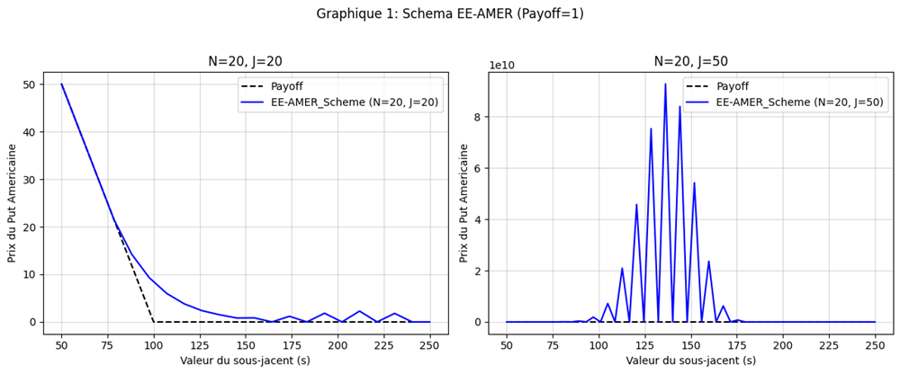

::: {.qf-meta}
Catégorie
:   Méthodes numériques · Dérivés & contrôle optimal

Statut
:   Terminé

Langages
:   Python

Contexte
:   Travaux du M2 Modélisation Aléatoire, Université Paris Cité
:::

## Vue d'ensemble

Toutes les formules fermées de la finance de marché s'arrêtent au même endroit :
dès qu'une contrainte d'exercice anticipé, une frontière libre ou un contrôle
apparaissent, il faut discrétiser. Ce projet rassemble quatre travaux qui
couvrent ce passage à l'analyse numérique, du plus classique au plus récent.

Il part de l'EDP de Black-Scholes résolue par différences finies, ajoute la
contrainte américaine — qui transforme l'équation en inéquation variationnelle —
traite un problème d'arrêt optimal par programmation dynamique, puis résout une
équation de Hamilton-Jacobi-Bellman-Isaacs par deux voies concurrentes :
différences finies avec Newton semi-lisse, et réseaux de neurones informés par
l'équation (PINNs).

## Contexte financier

**Options américaines.** Le droit d'exercer avant l'échéance fait apparaître
une frontière libre : le prix n'est plus solution d'une EDP mais d'une
inéquation variationnelle, avec contrainte d'obstacle $V \ge$ payoff. Aucune
formule fermée n'existe ; les desks utilisent des schémas numériques dont la
stabilité et l'ordre de convergence conditionnent directement la qualité du
*hedging*.

**Stabilité des schémas.** Le choix entre schéma explicite et implicite n'est
pas un détail d'implémentation : un schéma explicite mal paramétré diverge, et
la condition de stabilité impose un pas de temps qui peut rendre le calcul
inutilisable en production.

**Arrêt optimal.** C'est la structure mathématique commune à l'exercice
anticipé, aux stratégies de sortie et aux options réelles. L'étudier sur un
problème où la frontière théorique est connue permet de valider une méthode
avant de l'appliquer à un cas où elle ne l'est pas.

**Contrôle optimal stochastique.** L'équation HJB est le cadre de la couverture
dynamique et de la liquidation optimale de portefeuille. Sa version HJBI ajoute
un adversaire — un cadre robuste, adapté à l'incertitude de modèle.

## Méthodologie

### 1. Options européennes par différences finies

Discrétisation du domaine espace-temps, puis trois schémas :

| Schéma | Nature | Stabilité |
|---|---|---|
| Euler explicite | conditionnellement stable | contrainte de type CFL sur le pas de temps |
| Euler implicite | inconditionnellement stable | résolution d'un système linéaire par pas |
| Crank-Nicolson | inconditionnellement stable, ordre 2 en temps | système linéaire, version creuse implémentée |

Une version **creuse** de Crank-Nicolson est implémentée pour exploiter la
structure tridiagonale des matrices. Tests numériques sur put et call.

### 2. Options américaines

Aux mêmes schémas s'ajoutent le traitement de la contrainte d'obstacle :

- **PSOR** (*Projected Successive Over-Relaxation*) — relaxation successive avec
  projection sur la contrainte à chaque itération ;
- schémas **splittés** (`EI-AMER-SPLIT`, `CN-AMER-SPLIT`) — pas de diffusion
  suivi d'une projection ;
- schémas **BDF** (*Backward Difference Formula*) d'ordre supérieur.

### 3. Arrêt optimal et pont brownien

Problème d'arrêt optimal sur un jeu de cartes, résolu par **induction
rétrograde**. La frontière d'arrêt optimal discrète est calculée pour
différentes tailles $N$, puis comparée à la frontière continue théorique. La
partie asymptotique étudie la convergence de $V(N,N)/\sqrt{2N}$ et la
convergence des trajectoires discrètes vers le **pont brownien**.

### 4. Navigation de Zermelo : différences finies et PINNs

Problème de contrôle optimal — atteindre une cible en temps minimal sous
l'action d'un courant — formulé comme une équation **HJBI**. Deux approches :

- **Différences finies** avec un schéma de **Newton semi-lisse**, et mesure de
  l'ordre numérique de convergence, dans deux cas : $f$ correspondant à une
  solution explicite connue (validation), puis $f = 1$ où la solution exacte est
  inconnue ;
- **PINNs** — réseau de neurones dont la fonction de perte encode directement
  l'EDP. Trois variantes de la fonction de perte sont comparées, ainsi que
  l'impact des hyperparamètres $\eta_0$ et $\eta_k$, sur les mêmes deux cas,
  avec des vitesses de bateau $v_s = 0{,}5$ (plus lent que le vent) et
  $v_s = 0{,}6$.

## Cadre mathématique

**EDP de Black-Scholes.** Pour un prix d'option $V(s,t)$,
$$
\frac{\partial V}{\partial t}
+ \tfrac{1}{2}\sigma^2 s^2 \frac{\partial^2 V}{\partial s^2}
+ r s \frac{\partial V}{\partial s}
- rV = 0 ,
$$
résolue à rebours depuis la condition terminale $V(s,T) = \psi(s)$.

**Condition de stabilité du schéma explicite.** En notant $\Delta t$ et
$\Delta s$ les pas de discrétisation, le schéma d'Euler explicite n'est stable
que si
$$
\Delta t \;\le\; \frac{C}{\sigma^2 s_{\max}^2 / \Delta s^2} ,
$$
c'est-à-dire $\Delta t = O(\Delta s^2)$ : raffiner la grille en espace impose de
raffiner **quadratiquement** la grille en temps. C'est exactement ce que montre
la figure ci-dessous.

**Contrainte américaine.** Le prix résout l'inéquation variationnelle
$$
\min\left\{ -\frac{\partial V}{\partial t} - \mathcal{L}V ,\;\; V - \psi \right\} = 0 ,
$$
avec $\mathcal{L}$ le générateur de Black-Scholes. Sous forme discrète, chaque
pas de temps devient un problème de complémentarité linéaire
$$
A V^{n} \ge b^{n}, \quad V^{n} \ge \psi, \quad
\bigl(A V^{n} - b^{n}\bigr)^{\top}\bigl(V^{n} - \psi\bigr) = 0 ,
$$
que l'algorithme PSOR résout par itérations projetées
$$
V_i^{(m+1)} = \max\left\{ \psi_i ,\;
V_i^{(m)} + \frac{\omega}{a_{ii}}
\Bigl( b_i - \textstyle\sum_{j<i} a_{ij}V_j^{(m+1)} - \sum_{j\ge i} a_{ij}V_j^{(m)} \Bigr) \right\}.
$$

**Arrêt optimal.** La valeur se calcule par programmation dynamique
$$
V_n = \max\bigl\{ g_n ,\; \mathbb{E}[V_{n+1} \mid \mathcal{F}_n] \bigr\},
$$
la frontière d'arrêt optimal séparant la région de continuation de la région
d'exercice.

**Équation HJBI.** Le temps minimal $u$ vérifie, sur le domaine considéré,
$$
\min_{a \in \mathcal{A}} \max_{b \in \mathcal{B}}
\bigl\{ \, \mathcal{H}\bigl(x, \nabla u, a, b\bigr) \bigr\} = 0 ,
$$
équation non linéaire et non lisse, d'où le recours à un schéma de **Newton
semi-lisse** plutôt qu'à un Newton classique.

**PINNs.** Le réseau $u_\theta$ minimise une perte composite
$$
\mathcal{L}(\theta)
= \underbrace{\bigl\lVert \mathcal{N}[u_\theta] \bigr\rVert^2_{\Omega}}_{\text{résidu de l'EDP}}
+ \eta_0 \underbrace{\bigl\lVert u_\theta - g \bigr\rVert^2_{\partial\Omega}}_{\text{bord}}
+ \eta_k \, \mathcal{R}(\theta),
$$
le poids relatif des termes conditionnant entièrement la qualité de la solution
obtenue — ce que l'étude des hyperparamètres met en évidence.

## Résultats

{fig-alt="Deux graphiques du prix d'un put américain en fonction du sous-jacent : à gauche N=20, J=20 la courbe suit le payoff ; à droite N=20, J=50 la solution oscille jusqu'à 9e10"}

La figure illustre directement la contrainte de stabilité : à nombre de pas de
temps constant ($N = 20$), passer de $J = 20$ à $J = 50$ points d'espace fait
exploser la solution du schéma explicite de plusieurs ordres de grandeur. Le
schéma implicite et Crank-Nicolson restent stables dans les mêmes conditions.

Notebooks complets, avec leurs sorties d'origine :

- [Arrêt optimal et convergence vers le pont brownien](../M2MO/Numerical_methods/arret_optimal.ipynb)
- [Options européennes — Euler et Crank-Nicolson](https://github.com/usenameFD/Numerical_methods) *(sur GitHub)*
- [Options américaines — PSOR, schémas splittés et BDF](https://github.com/usenameFD/Numerical_methods) *(sur GitHub)*
- [Navigation de Zermelo — différences finies et PINNs](https://github.com/usenameFD/Numerical_methods) *(sur GitHub)*

::: {.callout-note collapse="true"}
## Pourquoi trois notebooks sont consultés sur GitHub

Les notebooks d'EDP européenne, d'EDP américaine et de navigation de Zermelo
utilisent des barres horizontales `---` dans leurs cellules Markdown. Quarto
interprète ces délimiteurs comme un bloc de métadonnées YAML et refuse de les
traiter. Plutôt que de modifier ces artefacts de recherche, ils sont conservés
intacts et consultables sur le dépôt GitHub. Les rapports PDF ci-dessous en
reprennent l'intégralité des résultats.
:::

Rapports associés :

- [Méthodes numériques (PDF)](../M2MO/Numerical_methods/Methode_Numerique.pdf)
- [Résolution du problème de navigation de Zermelo (PDF)](<../M2MO/Numerical_methods/EDP_resolution du probleme de navigation Zemelo.pdf>)

## Interprétation

Le fil conducteur des quatre travaux est la **validation d'une méthode sur un
cas où la réponse est connue avant de l'appliquer à un cas où elle ne l'est
pas** : solution explicite pour Zermelo, frontière théorique pour l'arrêt
optimal, formule fermée de Black-Scholes pour l'option européenne. C'est la
démarche attendue en validation de modèles numériques, et elle est ici
systématique.

Le second enseignement concerne les PINNs. Ils offrent une souplesse réelle
— pas de maillage, dimension supérieure accessible — mais leur précision dépend
fortement de la pondération des termes de perte, là où un schéma de différences
finies offre un ordre de convergence démontrable et mesurable. Sur un problème
où les deux approches sont applicables, la méthode déterministe reste la
référence contre laquelle le réseau est jugé.

## Limites et risque de modèle

- **Dimension.** Les schémas de différences finies restent limités à des
  dimensions faibles ; au-delà, le coût croît exponentiellement.
- **Conditions aux bords.** Les résultats dépendent de la troncature du domaine
  et du traitement des bords, non étudiés systématiquement ici.
- **Volatilité constante.** Le cadre Black-Scholes sous-jacent ne modélise ni le
  smile ni les sauts ; voir [Pricing d'options exotiques](options-exotiques-bates-heston.qmd).
- **PINNs.** Pas de garantie de convergence, sensibilité à l'initialisation et
  aux hyperparamètres, et coût d'entraînement sans commune mesure avec celui
  d'un solveur tridiagonal.
- **Portée.** Il s'agit de travaux académiques de validation méthodologique, non
  d'une bibliothèque de pricing de production.

## Technologies

::: {.qf-tags}
[Python]{.qf-tag} [NumPy]{.qf-tag} [SciPy]{.qf-tag}
[TensorFlow / Keras]{.qf-tag} [Matplotlib]{.qf-tag}
:::

## Ressources

- [Arrêt optimal](../M2MO/Numerical_methods/arret_optimal.ipynb)
- [Navigation de Zermelo et PINNs — rapport (PDF)](<../M2MO/Numerical_methods/EDP_resolution du probleme de navigation Zemelo.pdf>)
- [Méthodes numériques — rapport (PDF)](../M2MO/Numerical_methods/Methode_Numerique.pdf)
- [Consulter le dépôt GitHub](https://github.com/usenameFD/Numerical_methods)
- Projet connexe : [Pricing d'options exotiques sous Heston, Bates et CIR](options-exotiques-bates-heston.qmd)
- Projet connexe : [Bibliothèque de pricing et application Dash](bibliotheque-pricing-dash.qmd)

---

[← Retour aux projets](index.qmd)
