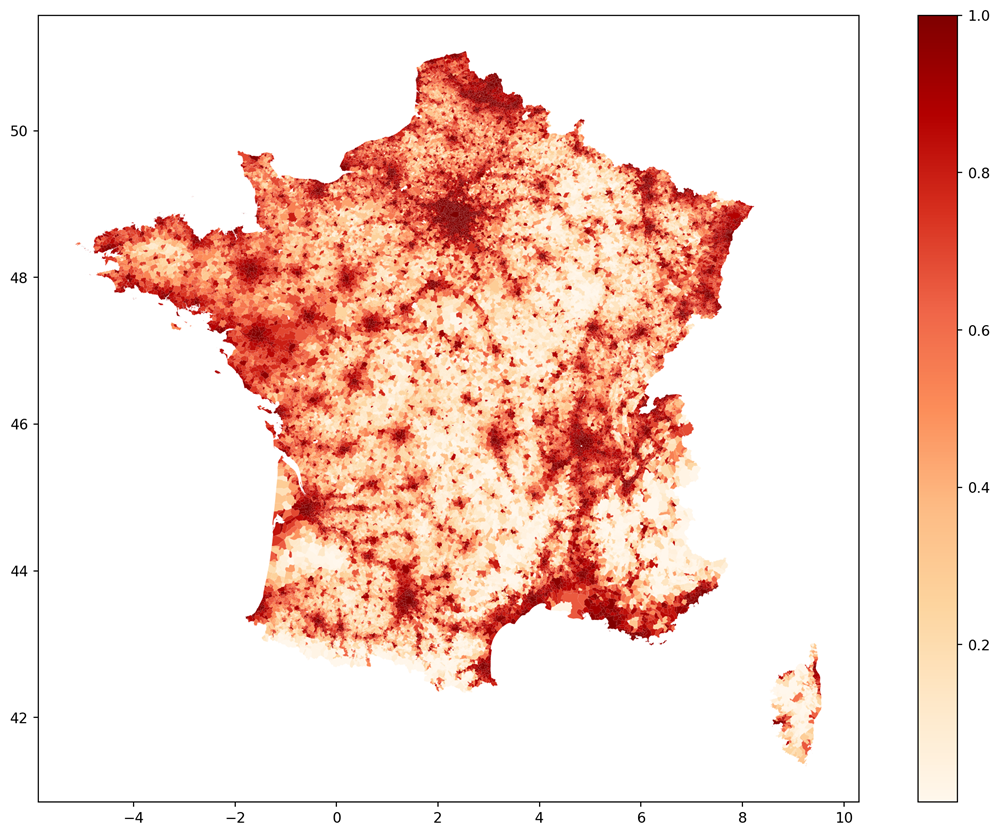

::: {.qf-meta}
Catégorie
:   Risque climatique · Données géospatiales

Statut
:   Terminé

Langages
:   Python

Livrables
:   Deux notebooks (indice d'exposition, risque physique), modules utilitaires
:::

## Vue d'ensemble

Le risque physique lié au changement climatique se matérialise localement : une
même exposition d'un portefeuille immobilier ou d'un portefeuille de prêts
n'emporte pas les mêmes conséquences selon la commune où se situent les actifs.

Ce projet construit un **indice d'exposition climatique à la maille communale**
pour l'ensemble du territoire français, en croisant deux dimensions : la
diversité des aléas climatiques reconnus sur la commune et la densité de
population qui y est exposée. L'indice est ensuite discrétisé en classes
d'exposition et cartographié. Un second volet met ces résultats en regard
d'indicateurs de risque physique construits à partir de projections
climatiques.

## Contexte financier

Le risque physique est devenu un objet de mesure réglementaire :

- **Stress tests climatiques.** Les superviseurs bancaires et assurantiels
  demandent une évaluation de l'exposition des portefeuilles aux aléas
  physiques, ce qui suppose une granularité géographique fine.
- **Assurance et réassurance.** La sinistralité liée aux catastrophes
  naturelles conditionne directement la tarification et la réassurance du
  régime français d'indemnisation des catastrophes naturelles.
- **Financement immobilier.** La valeur d'un bien et la probabilité de défaut
  du crédit associé dépendent de l'exposition physique du bien ; l'information
  au niveau du code postal est trop grossière.

La maille communale constitue le meilleur compromis disponible entre finesse
géographique et disponibilité des données officielles.

## Méthodologie

**1. Aléas climatiques et sinistralité.** Identification des communes classées
à risques majeurs par les services de l'État et des catastrophes naturelles
reconnues par arrêté, à partir de la base GASPAR.

**2. Densité de population.** Calcul de la densité communale à partir des
données de recensement, puis conversion en rang par quantiles afin de rendre la
variable comparable entre communes de tailles très différentes.

**3. Indice composite.** Combinaison multiplicative d'une note d'aléa et d'une
note de densité (voir ci-dessous).

**4. Discrétisation.** Segmentation en **six classes d'exposition** par la
méthode de Jenks (*natural breaks*), qui minimise la variance intra-classe.
Cette approche est préférée à un découpage par quantiles, qui imposerait des
effectifs égaux et masquerait les ruptures réelles de la distribution.

**5. Cartographie.** Représentation choroplèthe des niveaux d'exposition sur
le fond de carte des communes.

**6. Risque physique.** Le second notebook construit des indicateurs de risque
physique à partir de projections climatiques régionalisées, les rapproche des
catastrophes naturelles observées, produit les statistiques descriptives
associées et procède à une discrétisation analogue. Le critère d'indépendance
de Hilbert-Schmidt (HSIC) est disponible dans les utilitaires pour tester la
dépendance entre indicateurs.

## Cadre mathématique

**Nombre d'aléas.** Pour une commune $c$, le nombre d'aléas climatiques
déclarés agrège cinq familles :
$$
\mathrm{NB\_ALEA}_c
= \mathrm{ALEA}^{\text{inondation}}_c
+ \mathrm{ALEA}^{\text{feu}}_c
+ \mathrm{ALEA}^{\text{tempête}}_c
+ \mathrm{ALEA}^{\text{avalanche}}_c
+ \mathrm{ALEA}^{\text{mvt}}_c .
$$

**Indice d'exposition.** L'indice combine une note d'aléa et une note de
densité, chacune ramenée sur une échelle de 0 à 10 :
$$
\mathrm{Exposition}_c
= \frac{
\underbrace{\left( \dfrac{\mathrm{NB\_ALEA}_c}{\mathrm{NB\_ALEA}^{\max}} \times 10 \right)}_{\text{note d'aléa}}
\;\times\;
\underbrace{\bigl( q_c \times 10 \bigr)}_{\text{note de densité}}
}{10},
$$
où $q_c \in [0,1]$ est le quantile empirique de la densité de population de la
commune. La forme multiplicative traduit une hypothèse explicite : une commune
fortement exposée mais très peu peuplée, ou densément peuplée mais sans aléa
identifié, présente un risque agrégé faible. C'est la conjonction d'un aléa et
d'une population exposée qui crée le risque.

**Discrétisation de Jenks.** Le découpage en $k$ classes $\{C_1,\dots,C_k\}$
minimise la somme des variances intra-classes :
$$
\min_{C_1,\dots,C_k}\;
\sum_{j=1}^{k} \sum_{c \in C_j} \bigl( x_c - \bar{x}_{C_j} \bigr)^2 ,
\qquad k = 6 .
$$

**Critère HSIC.** Pour tester la dépendance entre deux indicateurs sans
hypothèse de linéarité, le critère de Hilbert-Schmidt s'estime par
$$
\widehat{\mathrm{HSIC}} = \frac{1}{n^2}\,\mathrm{tr}\bigl( K H L H \bigr),
\qquad H = I_n - \tfrac{1}{n}\mathbf{1}\mathbf{1}^{\top},
$$
où $K$ et $L$ sont les matrices de noyau des deux variables. Une valeur nulle
caractérise l'indépendance pour des noyaux caractéristiques, contrairement à un
coefficient de corrélation.

## Données

| Source | Contenu | Licence |
|---|---|---|
| GASPAR — communes à risque | aléas majeurs recensés par commune | données publiques |
| GASPAR — catastrophes naturelles | arrêtés de reconnaissance de catnat | données publiques |
| INSEE — recensement | population communale historique | données publiques |
| INSEE — table d'appartenance géographique 2025 | référentiel communal | données publiques |
| DRIAS / ALADIN63 — CNRM-CM5 | indices climatiques, scénarios RCP 2.6 et référence | données publiques |
| OpenStreetMap | fonds de carte | ODbL — © les contributeurs d'OpenStreetMap |

Les fonds cartographiques sont utilisés sous licence ODbL ; l'attribution
« © les contributeurs d'OpenStreetMap sous licence ODbL » s'applique à toute
reproduction des cartes produites.

## Implémentation

Deux notebooks complémentaires et deux modules utilitaires :

- `02_ExpoClimatCommune.ipynb` — construction et cartographie de l'indice
  d'exposition ;
- `03_PhysicalRisk.ipynb` — indicateurs de risque physique, rapprochement avec
  la sinistralité observée, statistiques descriptives et discrétisation ;
- `myFunctions.py` — fonctions de préparation, d'agrégation et de cartographie ;
- `hsic.py` — estimateur du critère d'indépendance de Hilbert-Schmidt.

Le traitement géospatial s'appuie sur `GeoPandas` et la discrétisation sur
`jenkspy`.

## Résultats

Les cartes d'exposition, les distributions par classe et les statistiques
descriptives croisant indicateurs de risque et sinistralité observée sont
présentées dans les notebooks :

[Indice d'exposition climatique des communes](Climate/Notebooks/02_ExpoClimatCommune.ipynb)

[Indicateurs de risque physique](Climate/Notebooks/03_PhysicalRisk.ipynb)

{fig-alt="Carte de France par commune colorée selon six classes d'exposition aux aléas climatiques"}

## Interprétation

La cartographie fait apparaître une structure spatiale nette : les niveaux
d'exposition les plus élevés se concentrent sur les zones combinant
sinistralité récurrente et forte densité, alors que des territoires exposés
mais peu peuplés ressortent en classe basse.

Ce résultat est directement une conséquence de la forme multiplicative de
l'indice, et c'est précisément pour cette raison qu'il doit être interprété
avec prudence : l'indice mesure une **exposition de population**, pas une
intensité d'aléa. Pour un usage assurantiel, il devrait être repondéré par la
valeur assurée plutôt que par la population ; pour un usage bancaire, par
l'exposition au bilan.

## Limites et risque de modèle

- **Sinistralité comme approximation de l'aléa.** Les arrêtés de catastrophe
  naturelle reflètent un processus administratif autant qu'un phénomène
  physique, avec des biais de déclaration entre territoires.
- **Pondération implicite.** La combinaison multiplicative attribue le même
  poids aux deux dimensions ; aucune calibration sur des pertes observées n'est
  effectuée.
- **Aléas non pondérés en intensité.** Le comptage des familles d'aléas ne
  distingue pas leur sévérité ni leur fréquence.
- **Maille communale.** Elle reste grossière pour des aléas très localisés
  comme l'inondation, qui dépendent de la topographie à l'échelle du bâtiment.
- **Scénario unique.** Seul le scénario RCP 2.6 est mobilisé dans le volet
  projections ; une analyse de sensibilité aux scénarios plus sévères serait
  nécessaire pour un exercice de stress test.
- **Absence de vulnérabilité.** Le risque physique combine aléa, exposition et
  vulnérabilité ; cette dernière dimension — qualité du bâti, protections
  existantes — n'est pas modélisée.

## Technologies

::: {.qf-tags}
[Python]{.qf-tag} [pandas]{.qf-tag} [GeoPandas]{.qf-tag} [jenkspy]{.qf-tag}
[NumPy]{.qf-tag} [Matplotlib]{.qf-tag}
:::

## Ressources

- [Indice d'exposition climatique des communes](Climate/Notebooks/02_ExpoClimatCommune.ipynb)
- [Indicateurs de risque physique](Climate/Notebooks/03_PhysicalRisk.ipynb)
- [Voir le code source des utilitaires](https://github.com/usenameFD/usenameFD.github.io/tree/main/projects/Climate/Notebooks)
- Projet connexe : [Construction d'un univers d'investissement ESG](univers-investissement-esg.qmd)
- Note associée : [Investissement responsable et finance durable](../autres/finance_durable.qmd)

---

[← Retour aux projets](index.qmd)
